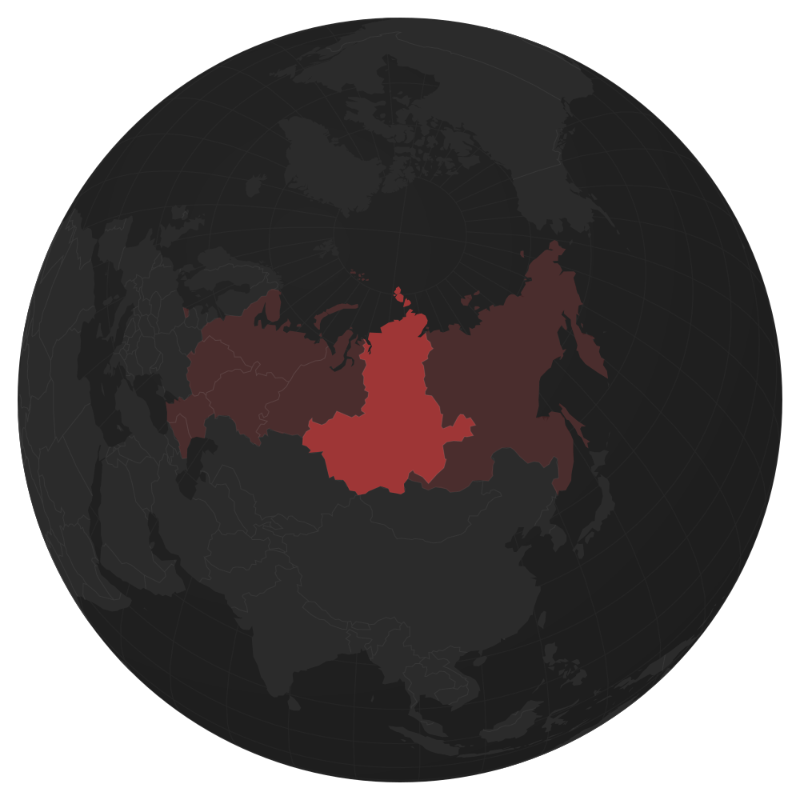
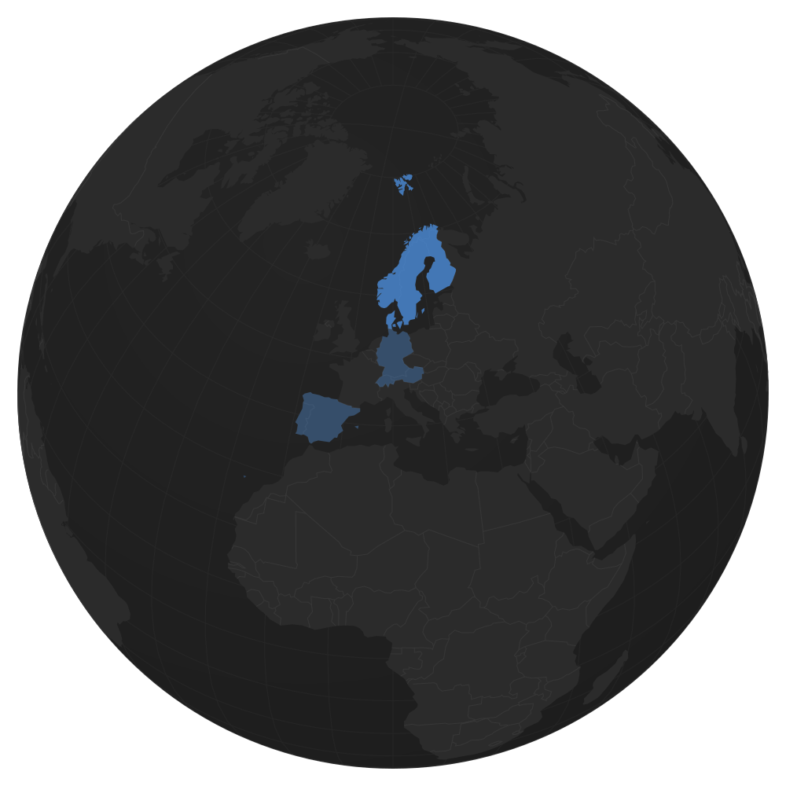

# globe-svg

Render an orthographic globe with highlighted regions into a **static SVG** — at build
time, not in the browser. Your page ships one cacheable image plus, optionally, a small
JSON of region outlines for hover/click interactivity. No mapping library, no tiles,
zero runtime JavaScript required.

<p align="center">
  
  
</p>

Built for "we operate here" blocks: coverage maps, dealer networks, office locations.
That picture only changes when your business does — so render it once, at build time.

## Quick start

```bash
npx globe-svg --config globe.config.json
```

```json
{
  "center": [10, 45],
  "regions": {
    "source": "ne-admin0-50m",
    "key": "ADM0_A3",
    "groups": [
      { "id": "dach", "codes": ["DEU", "AUT", "CHE"] },
      { "id": "nordics", "codes": ["NOR", "SWE", "FIN", "DNK"] },
      { "id": "iberia", "codes": ["ESP", "PRT"] }
    ]
  }
}
```

This writes two artifacts next to the config:

| File | What it is | How to use it |
| --- | --- | --- |
| `globe.svg` | Self-contained backdrop: ocean disc, graticule, land, country borders | `` — one request, cached for the whole site |
| `globe-regions.json` | `{ viewBox, borders, regions: [{ id, d }] }` | Inline the paths in an `<svg>` overlay for interactivity |

Both are computed with the **same projection and viewBox**, so stacking the overlay on
the image lines up pixel-perfectly:

```html
<div style="position: relative">
  
  <svg viewBox="0 0 1000 1000" style="position: absolute; inset: 0; width: 100%; height: 100%">
    <!-- one <path d="…"> per region; style :hover / .active with plain CSS -->
  </svg>
</div>
```

Working integrations: [`examples/astro-component`](examples/astro-component) and
[`examples/plain-html`](examples/plain-html). Programmatic use:

```js
import { generate } from 'globe-svg'
const { svg, layer, warnings } = await generate(config)
```

## Why not a mapping library?

Runtime globes and vector maps (Leaflet, MapLibre, amCharts, globe.gl, jsvectormap)
cost 50–300 KB of JavaScript, run projection math on your users' devices, and most
of them only offer flat projections anyway. A static coverage map needs none of that:
the SVG here is ~80 KB (≈25 KB gzipped), crisp on any display, and the optional
interactive layer is a JSON of path strings — ~30 lines of your own vanilla JS.

## Config reference

Everything is optional except `center` being something other than `[0, 0]` if you
care about the framing.

| Key | Default | Meaning |
| --- | --- | --- |
| `size` | `1000` | Square viewBox `0 0 size size` |
| `margin` | `22` | Space between globe and viewBox edge; radius = `size/2 − margin` |
| `center` | `[0, 0]` | `[longitude, latitude]` placed at the center of the frame |
| `detail` | `0.08` | Fraction of geometry points kept after simplification (0..1]. `0.08` is clean up to ~1200 px wide; raise it for posters |
| `digits` | `1` | Decimal places in path coordinates |
| `graticule` | `true` | Draw the 10° meridian/parallel grid |
| `colors` | dark theme | `disc: [inner, outer]`, `graticule`, `land`, `borders`, `rim` |
| `regions` | `null` | See below |
| `sources` | built-in | Override the backdrop dataset: `{ "backdrop": … }` (path or URL to an admin-0-like GeoJSON FeatureCollection) |
| `output` | `.` / `globe.svg` / `globe-regions.json` | `dir` is relative to the config file |

### Regions

```json
"regions": {
  "source": "ne-admin1-50m",
  "key": "iso_3166_2",
  "groups": [{ "id": "central", "codes": ["RU-MOW", "RU-MOS", "…"] }]
}
```

- `source` — `"ne-admin0-50m"` (countries), `"ne-admin1-50m"` (states/provinces of the
  ~10 largest countries), a URL, or a local GeoJSON FeatureCollection path.
- `key` — feature property holding the code. Use `ADM0_A3` for countries (Natural
  Earth leaves `ISO_A3` as `-99` for France, Norway and a few others) and
  `iso_3166_2` for admin-1. Lookup is case-insensitive across property casings.
- `groups` — each becomes one merged `<path>` in the layer. Inner boundaries between
  subdivisions of the same group disappear; `layer.borders` contains only the lines
  **between different groups** (no coastlines), ready for a subtle stroke.

Codes that match nothing produce a warning listing them; a group that matches nothing
is an error.

## Data & caching

All geometry comes from [Natural Earth](https://www.naturalearthdata.com/)
(public domain) at 1:50m scale, **pinned to release v5.1.2** for reproducible
output. Land and country borders are both derived from the single admin-0
dataset (land is the union of all countries), so the backdrop layers align
exactly by construction, and the region layer shares the same scale and version.

Files download on first run into `~/.cache/globe-svg` (override with
`GLOBE_SVG_CACHE`) and are reused afterwards, so CI needs network only once per
cache lifetime.

Disputed territories are rendered exactly as Natural Earth ships them (de-facto
policy). If you need different boundaries, point `regions.source` / `sources` at your
own GeoJSON.

## Dependencies

Four, all build-time, none reach the browser — the full installed tree is
7 packages / ~1.4 MB:

- [`d3-geo`](https://github.com/d3/d3-geo) — the hard part: spherical clipping
  at the horizon and adaptive resampling of great-circle arcs. The forward
  orthographic projection is ten lines; cutting polygons at the edge of the
  visible hemisphere correctly is not.
- [`topojson-server` / `topojson-client` / `topojson-simplify`](https://github.com/topojson) —
  shared-arc topology, which is what makes merged groups seamless, group
  borders coastline-free, and simplification consistent along shared edges.

These libraries see few releases because they are *finished*, not abandoned:
projection math and topology algorithms don't rot the way data does (which is
exactly why the data side is pinned to a Natural Earth release instead).

## Scope

Orthographic projection, static output — by design. Rotation, zoom and pan are
explicitly out of scope: if the globe must move, you want a runtime library
(d3-geo in the browser, globe.gl), not this tool.

## License

[MIT](LICENSE). Natural Earth data is public domain.
