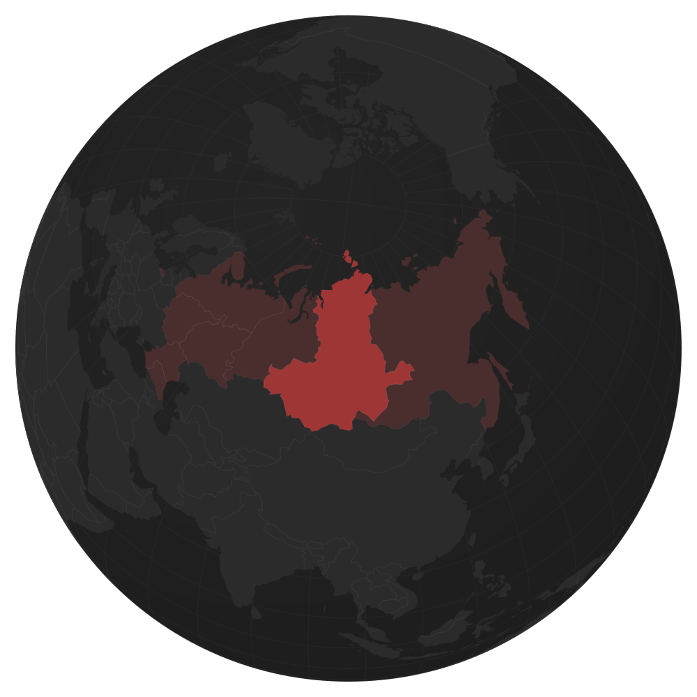
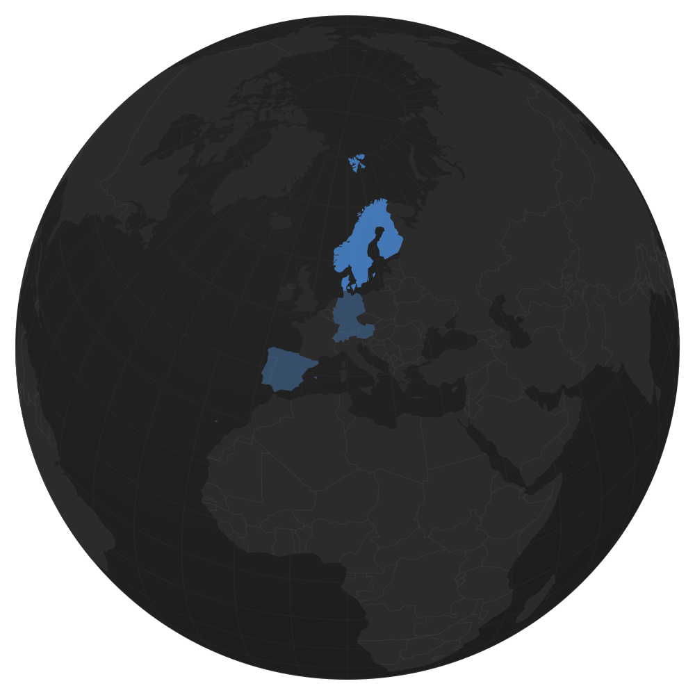

# globe-svg

Renders an orthographic globe with highlighted regions into a static SVG at build time. The page
ships one cacheable image and, optionally, a small JSON of region outlines for hover and click.
Made for coverage maps, dealer networks and office locations.

[](https://www.npmjs.com/package/globe-svg)
[](https://github.com/eeegoloauq/globe-svg/actions/workflows/ci.yml)
[](./LICENSE)

<p>
  
  
</p>

## Quick start

Requires Node.js 20 or newer.

```bash
npx globe-svg --config globe.config.json
```

```json
{
  "center": [10, 45],
  "regions": {
    "source": "ne-admin0-50m",
    "key": "ADM0_A3",
    "groups": [
      { "id": "dach", "codes": ["DEU", "AUT", "CHE"] },
      { "id": "nordics", "codes": ["NOR", "SWE", "FIN", "DNK"] },
      { "id": "iberia", "codes": ["ESP", "PRT"] }
    ]
  }
}
```

This writes `globe.svg` next to the config and, when a region layer exists, `globe-regions.json`:

| File | What it is | How to use it |
| --- | --- | --- |
| `globe.svg` | Self-contained backdrop: ocean disc, graticule, land, country borders | ``, cached for the whole site |
| `globe-regions.json` | `{ viewBox, borders, regions: [{ id, d }] }` | Inline the paths in an `<svg>` overlay for interactivity |

Both use the same projection and viewBox, so the overlay lines up with the image:

```html
<div style="position: relative">
  
  <svg viewBox="0 0 1000 1000" style="position: absolute; inset: 0; width: 100%; height: 100%">
    <!-- one <path d="…"> per region; style :hover / .active with plain CSS -->
  </svg>
</div>
```

Working integrations: [`examples/astro-component`](examples/astro-component) and
[`examples/plain-html`](examples/plain-html). Programmatic use:

```js
import { generate } from 'globe-svg'
const { svg, layer, warnings } = await generate(config)
```

## Compared with a mapping library

Runtime globes and vector maps (Leaflet, MapLibre, amCharts, globe.gl, jsvectormap) add 50–300 KB
of JavaScript and project on the user's device; most offer only flat projections. The example SVGs
here are about 80 KB, 35 KB gzipped. The interactive layer is a JSON of path strings and about 30
lines of your own JavaScript.

## Config reference

Every key is optional. Set `center` to frame the globe on your area.

| Key | Default | Meaning |
| --- | --- | --- |
| `size` | `1000` | Square viewBox `0 0 size size` |
| `margin` | `22` | Space between globe and viewBox edge; radius = `size/2 − margin` |
| `center` | `[0, 0]` | `[longitude, latitude]` placed at the center of the frame |
| `detail` | `0.08` | Fraction of geometry points kept after simplification (0..1]. `0.08` is clean up to ~1200 px wide; raise it for posters |
| `digits` | `1` | Decimal places in path coordinates |
| `graticule` | `true` | Draw the 10° meridian/parallel grid |
| `colors` | dark theme | `disc: [inner, outer]`, `graticule`, `land`, `borders`, `rim` |
| `regions` | `null` | See below |
| `sources` | built-in | Override the backdrop dataset: `{ "backdrop": … }` (path or URL to an admin-0-like GeoJSON FeatureCollection) |
| `output` | `.` / `globe.svg` / `globe-regions.json` | `dir` is relative to the config file |

### Regions

```json
"regions": {
  "source": "ne-admin1-50m",
  "key": "iso_3166_2",
  "groups": [{ "id": "central", "codes": ["RU-MOW", "RU-MOS", "…"] }]
}
```

- `source`: `"ne-admin0-50m"` (countries), `"ne-admin1-50m"` (states/provinces of the
  ~10 largest countries), a URL, or a local GeoJSON FeatureCollection path.
- `key`: the feature property holding the code. Use `ADM0_A3` for countries (Natural Earth leaves
  `ISO_A3` as `-99` for France, Norway and a few others) and `iso_3166_2` for admin-1. The key is
  also tried in upper and lower case, since Natural Earth releases differ.
- `groups`: each becomes one merged `<path>` in the layer, without the inner boundaries of its
  subdivisions. `layer.borders` holds only the lines between different groups, without
  coastlines.

Codes that match nothing produce a warning listing them; a group that matches nothing
is an error.

## Data & caching

All geometry comes from [Natural Earth](https://www.naturalearthdata.com/)
(public domain) at 1:50m scale, pinned to release v5.1.2 for reproducible output. Land and
country borders both come from the admin-0 dataset (land is the union of all countries), so the
backdrop layers align, and the region layer uses the same scale and release.

Files are downloaded on the first run into `~/.cache/globe-svg` (override with
`GLOBE_SVG_CACHE`) and reused after that.

Disputed territories are drawn as Natural Earth ships them (de facto boundaries). For different
boundaries, point `regions.source` or `sources` at your own GeoJSON.

## Dependencies

Four, all build-time; nothing reaches the browser. The installed tree is 7 packages, about
1.4 MB.

- [`d3-geo`](https://github.com/d3/d3-geo): clipping at the horizon and resampling of great-circle
  arcs.
- [`topojson-server` / `topojson-client` / `topojson-simplify`](https://github.com/topojson):
  shared-arc topology for seamless merged groups, borders without coastlines, and consistent
  simplification along shared edges.

## Scope

Orthographic projection and static output only. For rotation, zoom or pan, use a runtime library
such as d3-geo in the browser or globe.gl.

## License

[MIT](LICENSE). Natural Earth data is public domain.
